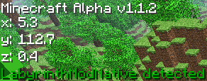
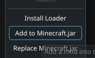
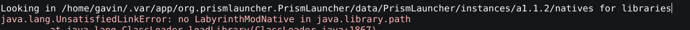

# "The Labyrinth" Speedrunning Utilites

This repo resources for speedrunning [The Labyrinth](https://www.minecraftforum.net/forums/mapping-and-modding-java-edition/maps/1454461-adv-the-labyrinth-a-dungeon-map-third-semifinal), the earliest known Minecraft adventure map. 

It includes a mod for Minecraft Alpha 1.1.2 that:

a.) that shows the player's position on screen.

b.) makes a autosplitter possible, by copying said position in memory in such a way that external programs can hook into.

# [Mod Download](https://github.com/IoIxD/The-Labyrinth-Speedrunning-Resources/releases/latest)

# Usage

**Reading this is carefully important as installing the mod is not like any other Minecraft mod.**

First of all, since it's a coremod, you'll need to install it differently. For Prism Launcher (and presumably other MultiMC based launchers), you'll have to use this option in the version tab: 

and select the .zip that you downloaded (do not extract the .zip).

In absense of a launcher, you'll need to extract the .zip and put the .class files in your minecraft.jar.

If you want the autosplitter to work, then after installing it, the corresponding `.dll` file needs to be placed in the appropriate natives directory for your Minecraft instance so that it can be run at runtime. If you don't know what the directory is, the mod will print it out when it tries to load it, something that happens when you open up a world.

That said, Prism Launcher (and presumably other launchers based on MultiMC) will not let you override the path to the natives directory, **and the path it does set gets deleted when you close the game!** You'll have to copy the library into the `natives` directory every time you start up the game. 

If this sounds inconvienent for you, you may consider building the mod from source via [RetroMCP-Java](http://github.com/MCPHackers/RetroMCP-Java) and launching the game from within the program, as it doesn't delete its natives directory.

Those are the only specific instructions. Installing the autosplitter script is exactly as you would any other game.

# Building

Get [RetroMCP-Java](http://github.com/MCPHackers/RetroMCP-Java) and decompile version Alpha 1.1.2. Apply the current code by placing the patch file in `minecraft/src/net` and doing `git patch`. Click Recompile to recompile the mod, then (optionally) click MCP->Launch client to launch the game with the mod installed.

For committing changes, create a patch file via `Create Patch` and submit that.
